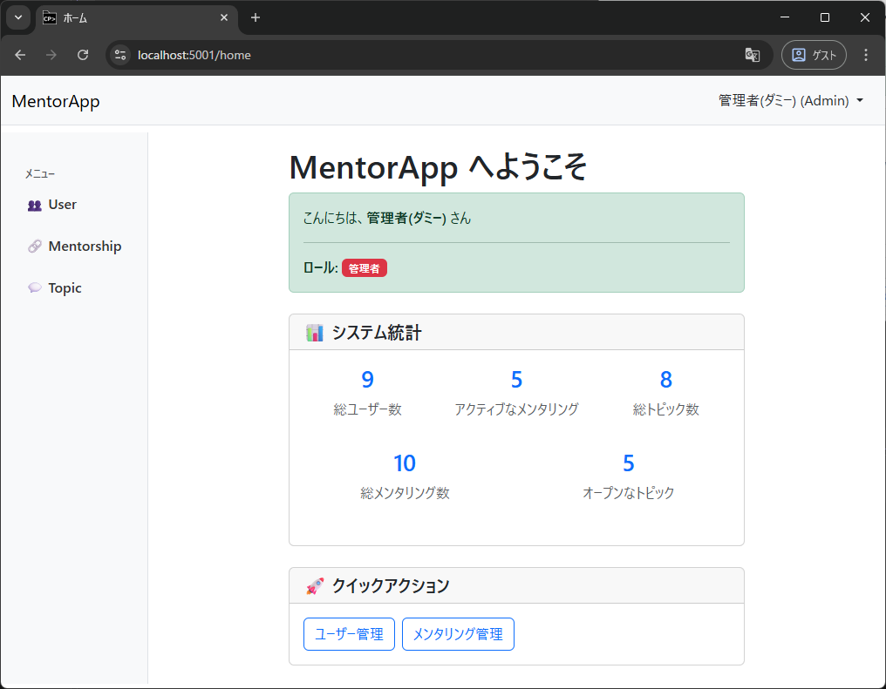

# MentorApp

メンターがメンティーを指導するためのチャットアプリケーション。話題ごとにトピックを作成し、テキストベースでやり取りできます。

**Blazor Server 学習シリーズ**の題材アプリとして、モダンな .NET 開発手法を実践的に学ぶことを目的としています。



## 学習のゴール

- レイヤー分離（クリーンアーキテクチャ）を実践する
- DDD の基本概念を体験する
- 認証・認可の仕組みを理解する
- 自動テストを書けるようになる

## 技術スタック

| 領域 | 選定 |
|------|------|
| ランタイム | .NET 10 |
| フレームワーク | Blazor Server |
| DB | EF Core コードファースト (SQL Server LocalDB / Azure SQL Database / SQLite / InMemory) |
| 認証 | OIDC + Cookie 認証（Entra ID / Google / Mock） |
| UI | Bootstrap 5 (LibMan でローカル配置) |
| ログ | Serilog |
| テスト | xUnit v3 + Playwright |

## 前提条件

- .NET 10 SDK
- LibMan CLI (`dotnet tool install -g Microsoft.Web.LibraryManager.Cli`)
- SQL Server LocalDB（SQL Serverプロバイダー使用時のみ必要）
- Entra ID または Google の OAuth 設定（本番認証を使用する場合）

## セットアップ

### 1. リポジトリのクローン

```bash
git clone <repository-url>
cd MentorApp
```

### 2. クライアントライブラリの復元

Bootstrap 等のフロントエンドライブラリは LibMan で管理しています。初回およびライブラリ更新時に復元が必要です。

> **Note:** ライブラリはリポジトリに同梱済みのため、ライブラリを更新しない限りこの手順はスキップ可能です。

```bash
cd src/MentorApp.Web
libman restore
```

### 3. Development 環境での起動

Development 環境ではモック認証が有効になっており、外部 IdP の設定なしで動作確認できます。
**モック認証は開発専用です。本番環境では必ず `Authentication:Provider` を `EntraId` または `Google` に設定し、`AllowedHosts` も実際のドメインに限定してください。**

初回クローン後に `appsettings.Development.json` をコピーしてください（コピーしなくても Mock として最低限の動作はします）。

```powershell
Copy-Item src/MentorApp.Web/appsettings.Development.json.example src/MentorApp.Web/appsettings.Development.json
```

#### Visual Studio で起動する場合

ソリューションを開き、スタートアッププロジェクトとして `MentorApp.Web` を選択してください（ソリューションエクスプローラーでプロジェクトを右クリック →「スタートアップ プロジェクトに設定」）。F5（デバッグ実行）または Ctrl+F5（デバッグなし実行）で起動できます。起動プロファイルは Visual Studio のツールバーから `https` または `http` を選択してください。

#### CLI で起動する場合

**HTTPS（推奨）:**

```bash
dotnet run --project src/MentorApp.Web --launch-profile https
```

`https://localhost:5001` で起動します。

**HTTP（証明書設定なしで手軽に確認）:**

```bash
dotnet run --project src/MentorApp.Web --launch-profile http
```

`http://localhost:5000` で起動します。

> **Note:** HTTPS にはサーバー証明書が必要です。Visual Studio を使用している場合は、初回の HTTPS デバッグ実行時に証明書の信頼ダイアログが自動的に表示されます。ダイアログが表示されない場合や CLI で起動する場合は、`dotnet dev-certs https --trust` を実行してください（初回のみ）。

### 4. Production 環境での起動

Production 環境では `Authentication:Provider` に `EntraId` または `Google` を設定し、実際の OIDC 認証で動作します。

#### 事前準備: appsettings.Production.json の作成

`appsettings.Development.json` / `appsettings.Production.json` はリポジトリに含まれていません（認証シークレットを含むため）。
リポジトリ同梱の `.example` ファイルをコピーし、実際の値を設定してください。

```powershell
Copy-Item src/MentorApp.Web/appsettings.Production.json.example src/MentorApp.Web/appsettings.Production.json
```

主な設定項目:
- `Authentication:Provider` — 使用する認証プロバイダー（`"EntraId"` または `"Google"`）
- `Authentication:Providers:EntraId` / `Google` — 対応するクライアント ID・シークレット
- `Authentication:InitialAdmin` — 初期管理者の外部 ID・メールアドレス

> **Note:** 認証プロバイダーの事前準備として、Entra ID または Google のコンソールでアプリを登録し、クライアント ID・シークレットを取得してください。リダイレクト URI として `https://<your-domain>/signin-oidc`（Entra ID）または `https://<your-domain>/signin-google`（Google）を適切に設定してください。

#### 方法A: dotnet run（手軽に確認）

```powershell
dotnet run --project src/MentorApp.Web --launch-profile https-production
```

`https://localhost:5001` で起動します。

#### 方法B: publish して実行（本番デプロイ相当）

```powershell
# 発行
dotnet publish src/MentorApp.Web -c Release -o ./publish

# 起動
cd publish
$env:ASPNETCORE_ENVIRONMENT = "Production"
$env:ASPNETCORE_URLS = "https://localhost:5001"
dotnet MentorApp.Web.dll
```

> **Note:** HTTPS 証明書の設定はセクション3を参照してください。

### 5. データベース

アプリケーションは3種類のデータベースプロバイダーをサポートしています。`appsettings.json` の `Persistence:Provider` で切り替え可能です。

#### SQL Server LocalDB（デフォルト）

開発環境・本番環境向け。初回起動時に自動でデータベースが作成されます。

> **Note:** SQL Server LocalDB のインストールには、Visual Studio Installer で「SQL Server LocalDB」を選択してください。Web 系のワークロードを選択すると同時にインストールされる場合もあります。

```json
"Persistence": {
  "Provider": "SqlServer"
}
```

接続文字列は `appsettings.json` で設定されています：
```
Server=(localdb)\MSSQLLocalDB;Database=MentorApp;...
```

> **Note:** Azure SQL Database を使用する場合、Azure SQL Database の作成・ファイアウォール設定を Azure ポータルまたは Azure CLI で事前に行ったうえで、同じ `SqlServer` プロバイダーのまま接続文字列を Azure SQL Database 用の形式（`Server=tcp:<server>.database.windows.net,1433;...`）に変更するだけで利用できます。

#### SQLite

軽量で設定不要。ファイルベースのデータベースとして動作します。
SQLite 関連の NuGet 脆弱性警告は EF Core SQLite からの推移的依存によるもので、本アプリでは SQL Server を主な利用対象としています。

```json
"Persistence": {
  "Provider": "Sqlite"
}
```

初回起動時に `mentorapp.db` ファイルが自動生成されます。

#### InMemory

テスト用。アプリケーション終了時にデータは消去されます。

```json
"Persistence": {
  "Provider": "InMemory"
}
```

### 6. 初期管理者の設定

`appsettings.json` の `Authentication:InitialAdmin` に初期管理者の情報を設定します。
アプリ起動時に Seed 処理で Admin ユーザーが作成されます。

```json
"Authentication": {
  "InitialAdmin": {
    "ExternalId": "（外部 IdP のユーザー ID）",
    "DisplayName": "管理者",
    "Email": "admin@example.com"
  }
}
```


## テストの実行

xUnit v3 (Microsoft.Testing.Platform) を使用しています。

```bash
# 基本実行
dotnet run --project tests/MentorApp.Tests

# リアルタイム出力あり
dotnet run --project tests/MentorApp.Tests -- -showLiveOutput

# dotnet test 経由でも実行可能
dotnet test
```


## デプロイ

Azure App Service（Linux、.NET 10 ランタイム）へのデプロイに対応しています。
`dotnet publish` でビルドし、ZIP デプロイで公開できます。

> **Note:** App Service リソース（プラン・Web アプリ）および Azure SQL Database の作成は Azure ポータルまたは Azure CLI で事前に行ってください。

認証設定や接続文字列は App Service のアプリケーション設定（環境変数）として設定してください。
JSON の階層区切り `:` は `__`（アンダースコア2つ）に置き換えます（例: `Persistence__Providers__SqlServer__ConnectionString`）。

## ドキュメント

[要件・設計ドキュメント](docs/spec.md)

## ソリューション構成

```
MentorApp/
├── src/
│   ├── MentorApp.Domain/          # ドメイン層（ビジネスロジックの中核）
│   ├── MentorApp.Application/     # アプリケーション層（ユースケース）
│   ├── MentorApp.Infrastructure/  # インフラ層（DB、認証など）
│   └── MentorApp.Web/             # Web層（Blazor Server）
├── tests/
│   └── MentorApp.Tests/           # テストプロジェクト
└── docs/
    spec.md                    # 要件・設計ドキュメント
```

### プロジェクト間の依存関係

```
Domain           ← 依存なし（最も内側）
    ▲
    │
Application      ← Domain を参照
    ▲
    │
Infrastructure   ← Domain, Application を参照
    ▲
    │
Web              ← 全プロジェクトを参照

Tests            ← 全プロジェクトを参照
```

### 各プロジェクトの役割

| プロジェクト | 役割 |
|-------------|------|
| **Domain** | エンティティ、値オブジェクト、リポジトリインターフェース。外部依存なし |
| **Application** | アプリケーションサービス（ユースケース）、DTO、インフラ層への契約（Contracts） |
| **Infrastructure** | EF Core による永続化、認証プロバイダー実装、DI 登録 |
| **Web** | Blazor コンポーネント、ページ、レイアウト、エントリポイント |
| **Tests** | アプリケーション層テスト、E2Eテスト（Playwright） |
