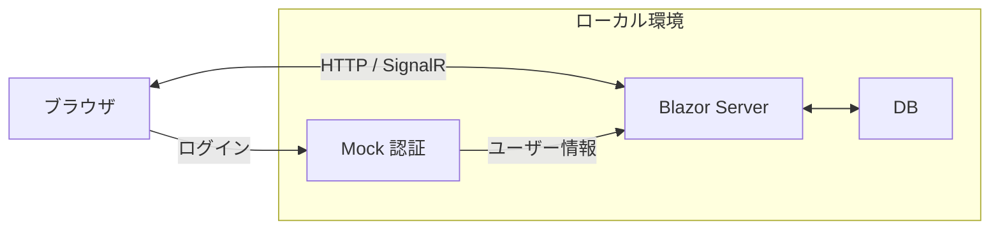
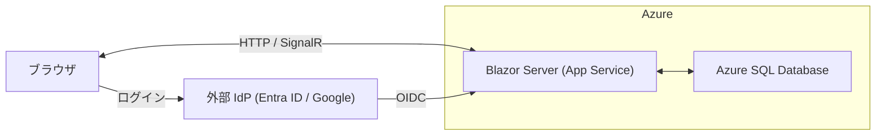
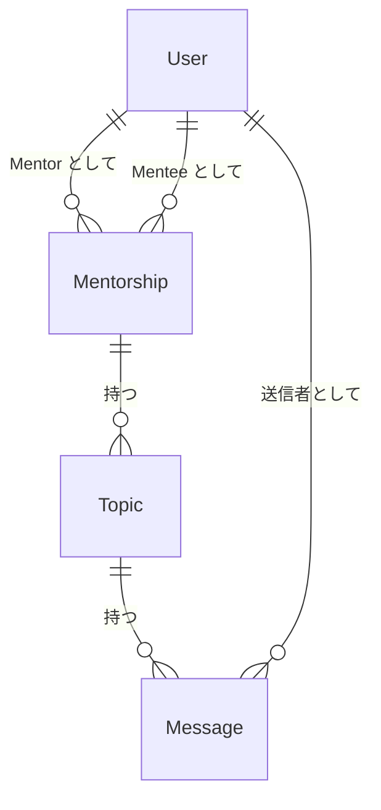
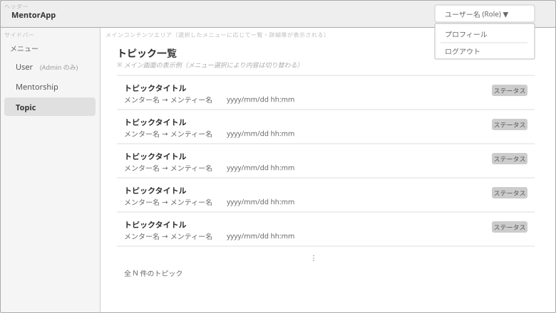
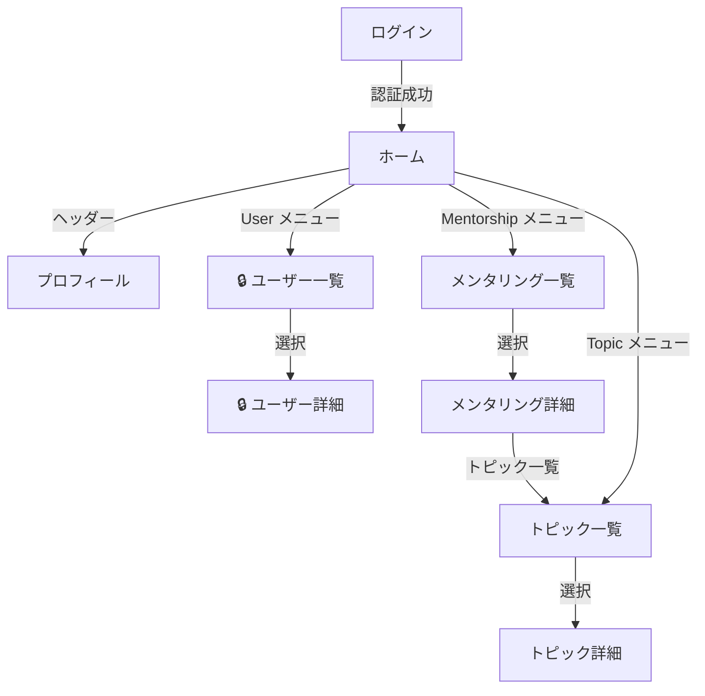

# 要件・設計ドキュメント

本ドキュメントは MentorApp の要件定義および設計情報をまとめたものです。

- 実装時のルール・規約については [開発ガイド](development-guide.md) を参照してください。
- セキュリティ実装の判断記録は [セキュリティ対策メモ](security-notes.md) を参照してください。
- 発展的な実装テーマの候補は [発展トピック](advanced-topics.md) を参照してください。

---

## 目次

1. [目的・背景](#1-目的背景)
2. [システム概要](#2-システム概要)
3. [要件定義](#3-要件定義)
4. [システム構成](#4-システム構成)
5. [データモデル](#5-データモデル)
6. [画面設計](#6-画面設計)

---

## 1. 目的・背景

### システムの目的

技術系のメンター・メンティサービスにおいて、メンターとメンティー間のコミュニケーションを一元管理し、トピックごとに整理された対話を通じて、効果的なメンタリングを支援する。

### 想定利用シーン

- メンターが複数のメンティーを担当し、個別の相談トピックを管理
- メンティーが過去の相談内容を振り返り、学習の記録として活用
- 管理者がメンタリング関係の状態を把握し、適切にマッチングを管理

### 将来展望

本システムで蓄積されたメンタリング対話データを活用し、将来的には以下のAI支援機能を実現する。

- 過去の類似相談の自動提示による知見の再利用
- メンタリング対話の要約・振り返り支援
- メンティーの成長傾向の分析とフィードバック

---

## 2. システム概要

### アプリケーション概要

メンターがメンティーを指導するためのチャットアプリケーション。話題ごとにトピックを作成し、トピック内でメッセージをやり取りする。

### ユーザーロール

本システムでは「ユーザー」という用語を、システムを利用する全ての人の総称として使用します。ユーザーは以下のいずれかのロールを持ち、ロールに応じた権限が付与されます。

| ロール | 説明 | 権限 | Mentorship への参加 |
|--------|------|------|---------------------|
| Admin（管理者） | システム全体を管理するユーザー | システム全体の管理 | 不可（管理のみ） |
| Mentor（メンター） | メンティーを指導するユーザー | 自分のメンティーとのやり取り | Mentor として可 |
| Mentee（メンティー） | メンターから指導を受けるユーザー | 自分のメンターとのやり取り | Mentee として可 |

### 主要機能の概略

- **ユーザー管理**: 管理者によるユーザーのロール変更、ユーザー自身による表示名編集
- **メンタリング管理**: 管理者によるメンター・メンティーペアの作成と管理
- **トピック管理**: メンタリング関係内での相談トピックの作成とクローズ
- **メッセージ管理**: トピック内でのメッセージ投稿と閲覧（追記のみ）

---

## 3. 要件定義

### 3.1 機能要件

#### ユーザー管理

- 管理者は全ユーザーの一覧を閲覧できる
- 管理者はユーザーのロール（Admin / Mentor / Mentee）を変更できる
- メンター・メンティーは自分の表示名を編集できる
- 管理者は全ユーザーの表示名を編集できる

#### メンタリング管理

- 管理者はメンターとメンティーのペアを登録できる
- メンター・メンティーは自分が関係するメンタリングの一覧を閲覧できる
- 管理者は全てのメンタリングを閲覧できる
- 管理者はメンタリングのステータス（Active / Completed / Cancelled）を変更できる
- メンターは自分が関係するメンタリングを完了（Completed）にできる
- 管理者はメンタリング関係を削除できる（Topicが存在しない場合のみ。誤作成の取り消しを目的とする。会話が開始済みの場合は完了または中止を使用する）

#### トピック管理

- メンター・メンティーは自分が関係するActive状態のメンタリングにトピックを作成できる
- メンター・メンティーは自分が関係するトピックの一覧を閲覧できる
- 管理者は全てのトピックを閲覧できる
- メンター・メンティーは自分が関係するトピックをクローズできる
- 管理者は全てのトピックをクローズできる

#### メッセージ管理

- メンター・メンティーは自分が関係するトピックにメッセージを投稿できる
- メンター・メンティーは自分が関係するトピックのメッセージを閲覧できる
- 管理者は全てのメッセージを閲覧できる
- メッセージの編集・削除は行わない（追記のみ）

#### 認証・認可

- ユーザーは外部IdP（OIDC）を通じてログインできる
- 初回ログイン時、ユーザーアカウントが自動作成される（初期ロール：Mentee）
- ユーザーはログアウトできる
- 各機能は定義されたロールに基づいてアクセス制御できる

#### 初期データ

- 設定ファイルに記載された ExternalId のユーザーを Admin として自動作成する
- この処理はアプリ起動時（初回ログインより前）に実行されるため、対象ユーザーが初めてログインした時点では既に Admin として登録済みとなる
- 対象 ExternalId のユーザーが既に存在する場合はスキップする（ロール変更は行わない）

#### 対象外機能

以下の機能は本システムの**対象外**とする。

- ファイル添付
- メール送信による各種通知
- AIによる対話支援（将来展望として検討）

### 3.2 非機能要件

現時点では定めない。本アプリは学習用途であるため、パフォーマンス、可用性、厳密なセキュリティ等の要件については考慮の対象外とする。

---

## 4. システム構成

### 共通技術スタック

環境（開発・製品）によらず共通して使用する技術。

| 領域 | 選定 |
|------|------|
| ランタイム | .NET 10 |
| フレームワーク | ASP.NET Core / Blazor Server |
| ORM | Entity Framework Core（コードファースト） |
| UI | Bootstrap 5 |
| ログ | Serilog |
| テスト | xUnit v3 + Playwright |

### 環境別構成

DB と認証プロバイダーは環境に応じて切り替わる。下記はそれぞれの典型的な構成例。

#### Development 環境（典型例）



| 項目 | 典型的な選択 |
|------|------------|
| DB | InMemory / SQLite / SQL Server LocalDB（`appsettings` で切替） |
| 認証 | Mock（外部 IdP 不要） |

外部サービスへの依存なしにローカルで完結する。Mock 認証により IdP 設定なしで動作確認できる。

> なお、Development 環境でも `appsettings` の設定変更により外部 IdP（Entra ID / Google）や Azure SQL Database を使用することができる。

#### Production 環境（典型例）



| 項目 | 典型的な選択 |
|------|------------|
| DB | Azure SQL Database（または SQL Server LocalDB） |
| 認証 | Entra ID または Google |
| ホスティング | Azure App Service |

### アーキテクチャパターン

- クリーンアーキテクチャ
- ドメイン駆動設計（DDD）のエッセンス

### レイヤー構成

| 層 | 責務 | 依存先 |
|----|------|--------|
| Web層 | UI表示、ユーザー操作の受付 | Application, Domain, Infrastructure |
| Application層 | ユースケースの実行、トランザクション制御 | Domain |
| Domain層 | ビジネスルール、ドメインモデル | なし |
| Infrastructure層 | データ永続化、外部サービス連携 | Domain, Application |

**依存の原則：**
- Domain層は他の層に依存しない（最も安定した層）
- Infrastructure層は依存性逆転の原則により、Domain/Application層が定義したインターフェースを実装

---

## 5. データモデル

4つのエンティティで構成される。



### User（ユーザー）

システムを利用するアカウント。ロール（Admin / Mentor / Mentee）により権限が異なる。

```
User
├── Id
├── ExternalId（IdPのsub）
├── DisplayName
├── Email（IdPから取得）
├── Role（Admin / Mentor / Mentee）
└── CreatedAt
```

### Mentorship（メンタリング関係）

Mentor と Mentee のペアリング関係。管理者が作成し、ステータスで進行状態を管理する。

```
Mentorship
├── Id
├── MentorUserId → User
├── MenteeUserId → User
├── Status（Active / Completed / Cancelled）
├── StartedAt
└── EndedAt?
```

### Topic（相談トピック）

Mentorship 内の個別の相談テーマ。Open / Closed のステータスで管理する。

```
Topic
├── Id
├── MentorshipId → Mentorship
├── Title
├── Status（Open / Closed）
└── CreatedAt
```

### Message（メッセージ）

Topic 内のチャットメッセージ。追記のみ（編集・削除なし）。

```
Message
├── Id
├── TopicId → Topic
├── SenderUserId → User
├── Content
└── SentAt
```

---

## 6. 画面設計

### UI設計方針

本アプリケーションは、ユーザーが「対象（User / Mentorship / Topic）」を起点に操作できるようUIを設計する。

### 画面レイアウトイメージ



### グローバルメニュー構成

| メニュー項目 | 表示条件 | 選択時の表示 |
|-------------|---------|-------------|
| User | Admin のみ | ユーザー一覧 |
| Mentorship | 全ロール | メンタリング一覧 |
| Topic | 全ロール | トピック一覧（Mentorship 経由も可） |

### 画面遷移



> 🔒 = Admin 限定画面

### 画面一覧

| 画面 | 種別 | 表示内容 | アクセス権限 |
|-----|------|---------|-------------|
| ログイン | 認証 | IdP へのリダイレクト | 未認証 |
| ホーム | ダッシュボード | ダッシュボード統計 + クイックアクション | 認証済み |
| ユーザー一覧 | 一覧 | User 一覧 | Admin |
| ユーザー詳細 | 詳細 | User 詳細 + ロール編集 | Admin |
| メンタリング一覧 | 一覧 | Mentorship 一覧 | 認証済み（自分に関係するもの、Adminは全件） |
| メンタリング詳細 | 詳細 | Mentorship 詳細 + ステータス変更 | 認証済み（完了はAdmin・Mentor、中止・削除はAdminのみ） |
| トピック一覧 | 一覧 | Topic 一覧（各 Topic は Mentorship 情報付きで表示） | 認証済み（自分に関係するもの、Adminは全件） |
| トピック詳細 | 詳細 | Message 一覧 + 投稿フォーム | 認証済み（自分が参加するトピックのみ、Adminは全件） |
| プロフィール | 詳細 | 自分の DisplayName 編集 | 全ロール（ヘッダーからアクセス） |

### 設計方針の補足

この方針により、ユーザーは「何に対して操作するか」を最初に決定し、その後で「何をするか」を選べるため、操作の文脈が明確になり学習コストが低減される。また、対象を中心とした設計はロールごとの権限差分の実装や将来的な機能拡張にも適している。
